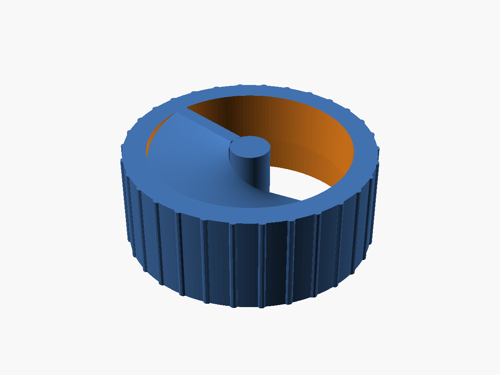

# Bialetti Moka Coffee Dosing / Leveling Helper

A 3D-printable helper for the **1-cup Bialetti Moka Express** that levels the
ground coffee flush with the filter funnel — no more guessing the dose or making
a mess.



## How it works

The tool is a single knurled cap that slips over the **outer rim of the boiler**
(with the filter funnel inserted) and rotates freely on it. A fixed **helical
blade** sits inside, sweeping just above the funnel rim:

- **Turn one way** — the flat bottom edge of the flight *levels* the grounds
  flush with the funnel.
- **Turn the other way** — the broad helical face acts as an *auger*, scooping
  the excess coffee powder up and out.

You pour the grounds through the wide open sector, then twist the whole tool on
the rim to dose. There is **nothing to assemble** — the skirt-over-rim clearance
is the bearing.

## Printing

- **One part, one orientation, no supports.** The exported `bialetti_funnel_helper.stl`
  is already in the correct print orientation (pour-cup opening down on the bed).
  Slice it as-is.
- Material: any (PLA/PETG). For food contact, prefer a food-safe filament and
  consider a food-safe coating.
- Recommended: 0.2 mm layer height, 3+ perimeters, 20% infill.

## Fit (measured dimensions)

| Dimension | Value |
|---|---|
| Boiler rim slip-over Ø | 51.0 mm |
| Skirt bore (rim + clearance) | 51.4 mm |
| Body outer Ø | 56.2 mm |
| Filter funnel level Ø | 45.0 mm |
| Blade helix twist | 200° |

These are set for one specific pot. **Measure yours** and adjust the parameters
in the source file if the fit differs.

## Customizing

The model is fully parametric OpenSCAD. Open `bialetti_funnel_helper.scad` and
edit the `[Moka fit]` and `[Blade]` parameter blocks. Key parameters:

- `boiler_top_d` — outer diameter the helper slips over (**the critical fit**)
- `funnel_rim_d` — filter funnel rim / coffee-level diameter
- `clr` — slip/rotate clearance on the rim
- `blade_twist` — helix wrap in degrees (more = steeper auger)

Render / export from the command line:

```sh
# ready-to-print STL
openscad -o bialetti_funnel_helper.stl -D 'part="print"' bialetti_funnel_helper.scad

# functional preview (as it sits on the pot)
openscad -o preview.png -D 'part="model"' bialetti_funnel_helper.scad
```

`part` can be `print` (default, ready to slice), `model` (functional
orientation), or `section` (cutaway).

## Files

- `bialetti_funnel_helper.scad` — parametric source
- `bialetti_funnel_helper.stl` — ready-to-print mesh
- `preview.png` — render
